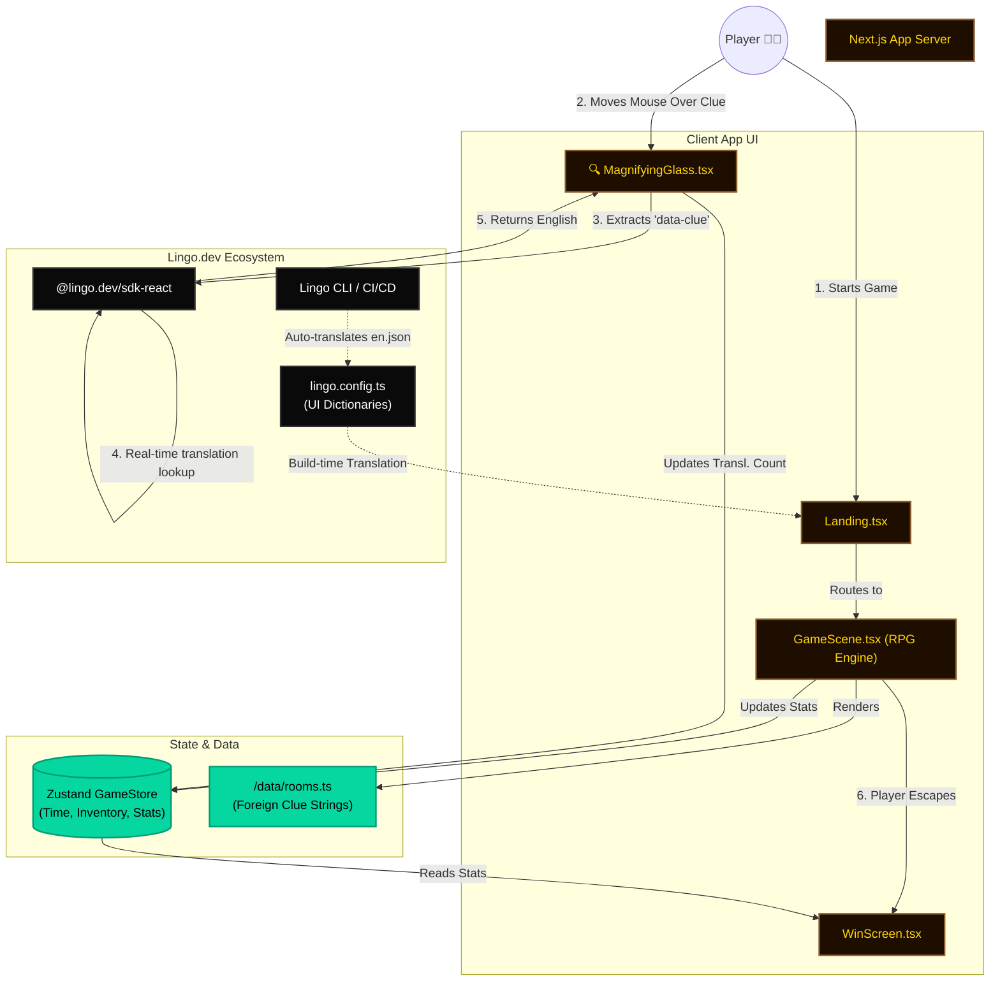

<div align="center">

# 🕵️‍♂️ Polyglot Escape

**A Multilingual Escape Room where Translation is your only weapon.**

[](https://lingo.dev)
[](https://nextjs.org/)
[](https://react.dev/)

*Built for the Lingo.dev Hackathon 2026*

</div>

---

## � Screenshots


## �📖 The Story

You awaken in the abandoned study of an ancient linguist. The door is locked, and the room is filled with cryptic clues: scorched diaries, cryptic murals, and strange chemical formulas. The catch? **Every clue is written in a different language.**

You are armed with a single tool: a **Magic Magnifying Glass**.

Hover your glass over any foreign text in the room to reveal its hidden meaning in real-time. Gather the translated clues, solve three distinct puzzles, and escape before the time runs out!

---

## 🌟 Why the Lingo.dev Integration Matters

### 1. The Magic Magnifying Glass (React SDK)
The core gameplay loops relies on the `@lingo.dev/sdk-react`. 
When the player hovers their cursor (styled as a magnifying glass) over decorative elements in the Stardew Valley-inspired world, we intercept the text and language tags (`data-clue="Güneş önce gelir" data-lang="Turkish"`). We then dynamically ping the translation engine to decode the text in real-time, displaying a beautiful UI tooltip.

### 2. Type-Safe UI Dictionaries (Lingo Compiler)
The game's actual user interface (Start Adventure buttons, Mission Briefings, Win Screens) isn't hardcoded. We use the Lingo.dev Compiler (`lingo.config.ts`) to generate type-safe dictionaries from our `src/locales/en.json`, ensuring our own UI is fully localizable.

### 3. Automated Translation (Lingo CLI & CI/CD)
Using the Lingo.dev CLI, our base strings are automatically translated into 10 different languages on every PR via our GitHub Actions workflow (`.github/workflows/lingo.yml`).

---

## 🎮 The Puzzles

Can you beat the escape room? You will encounter 8 different languages across 3 distinct puzzles:

| Puzzle | Translating From | The Challenge |
|--------|-----------------|---------------|
| **🔒 The Vault** | Japanese 🇯🇵, Arabic 🇸🇦 | Translate the linguist's scorch notes to deduce the 4-digit combination. |
| **⚗️ The Laboratory** | German 🇩🇪, Korean 🇰🇷, Russian 🇷🇺 | Read the foreign Warning Labels to mix the correct chemical antidote. |
| **🚪 The Final Door** | Latin 🏛️, Swahili 🇰🇪, Turkish 🇹🇷 | Decode the cryptic murals to press the ceremonial buttons in the correct sequence. |

---

## 🎨 Features & Polish

* **Chunky RPG Aesthetic:** A fully custom, Stardew Valley-inspired visual overhaul. Zero generic UI libraries. Everything from buttons, to dialogue boxes, to the win screen uses a consistent, custom CSS ruleset (`globals.css`) and `Press Start 2P` typography.
* **Cinematic Camera:** Sweeping CSS transforms and blurred backgrounds create an atmospheric intro sequence.
* **Interactive Top-Down Navigation:** Use WASD or click-to-move to navigate the Traveler around the cluttered study.
* **Intelligent Zone Detection:** The game tracks your spatial coordinates to trigger precise interaction prompts (`[E] WALL INSCRIPTION`) only when you are close to specific objects.
* **Dynamic Audio & VFX:** Floating particle dust, shooting stars, and one-shot sound effects for UI clicks and item pickups.
* **Stats Tracking:** At the end of the run, you are graded (S through C Rank) based on your speed and the number of words decoded.

---

## 🚀 Run it Locally

Ready to try and escape?

```bash
# Clone the repo
git clone https://github.com/yourusername/polyglot-escape.git
cd polyglot-escape

# Install dependencies
npm install

# Start the development server
npm run dev
```

Open [http://localhost:3000](http://localhost:3000) and click **START ADVENTURE**.

---

## 🏗️ Architecture

We designed a robust system where Lingo.dev sits at the center of the gameplay loop, intercepting user interactions and injecting real-time translations onto the canvas.



---
*Escape the room. Decode the world. Built for the Lingo.dev Hackathon.*
